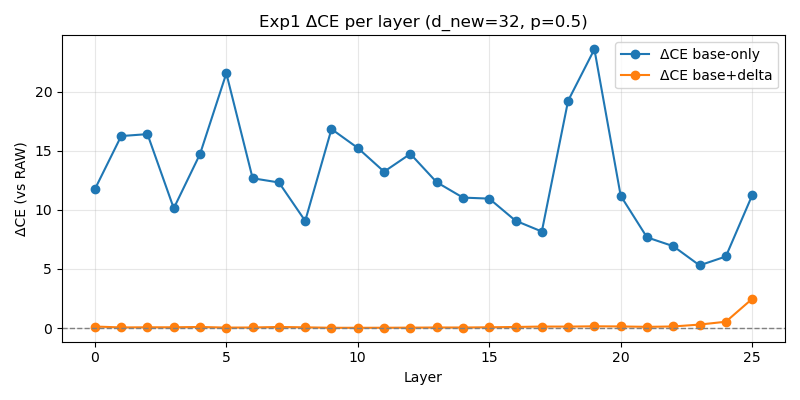
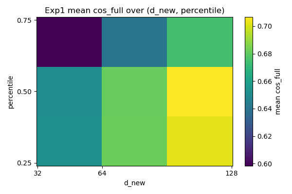
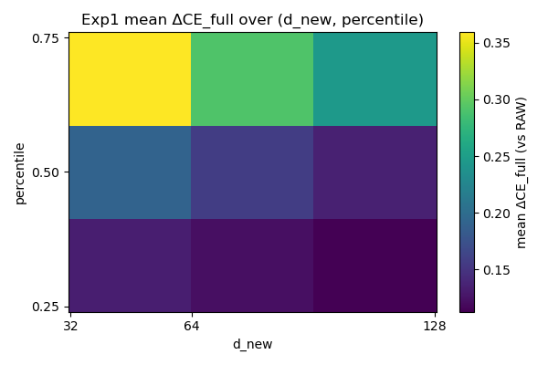
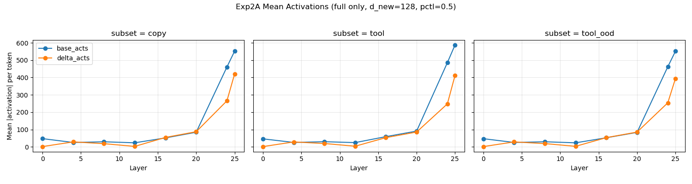
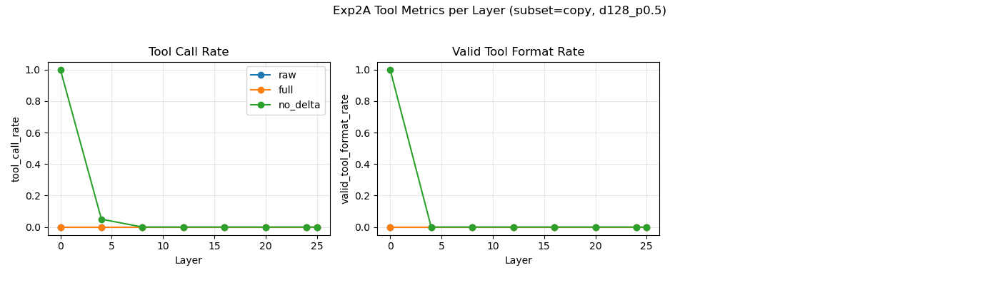
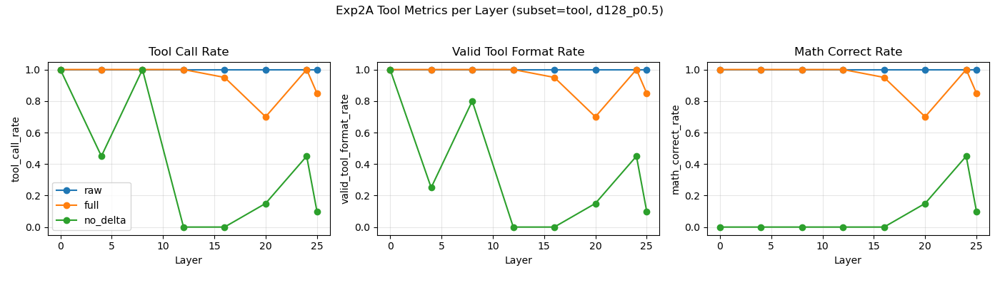
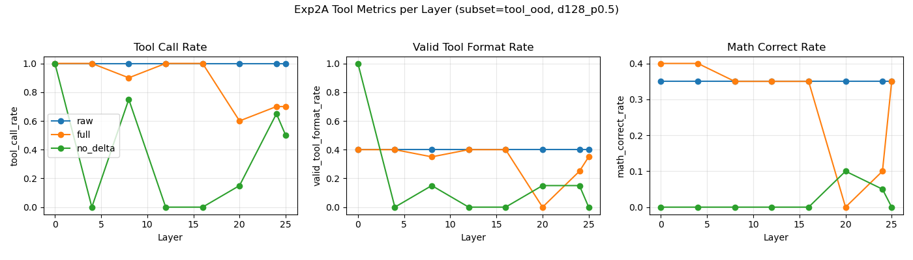
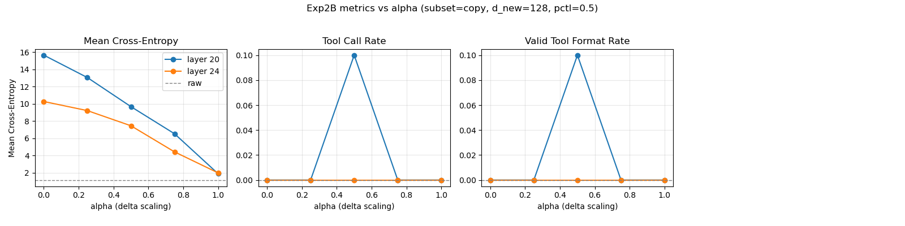
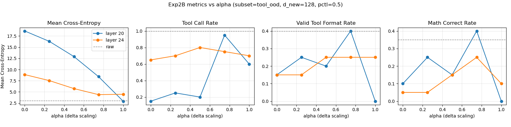

# Toolformer + Delta Transcoders for Gemma-2-2B

Short project exploring how a Gemma-2-2B model finetuned for calculator tool calls behaves internally, and an explainable and friendly fine-tuning method of Transcoders to match with the fine-tuned model to do mechanistic interpretability studies. The repo contains code to generate tool-calling data, finetune the model and SAEs, and run behavioral / mechanistic evaluations.

---

## What it Does

This project centers around two core questions:

1. When my fine-tuned Gemma-2-2B model invokes the calculator tool, is it truly "using a tool" to solve problems, or is it merely performing pattern matching on prompt templates?
2. If we treat the Google-provided Gemma-Scope SAE as a "frozen interpretable base" and only add a small set of delta features on top, is this "base SAE frozen + delta fine-tuning" approach a more controllable and interpretable method of fine-tuning?

To address these questions, this project studies a Gemma-2-2B causal language model finetuned to use a calculator tool via `<tool_call>calculator(expr)</tool_call>` generations. On top of an existing Gemma-Scope SAE (“Transcoder”), we train small delta transcoders and then intervene on the model’s MLP activations at specific layers. We systematically compare three conditions—raw model, base SAE only (`no_delta`), and base+delta (`full` / scaled alphas)—across in-distribution tool prompts, non-tool “copy” prompts, and out-of-distribution (OOD) tool prompts. The code reproduces the dataset generation, model finetuning, Experiment 1 (SAE validation) and Experiments 2A/2B (behavioral and mechanistic probing).


---

## Quick Start

### 1. Environment Setup

From the repo root:

```bash
python -m venv .venv
source .venv/bin/activate

pip install -r requirements.txt
```

This will install PyTorch, Hugging Face Transformers/PEFT, a local modified copy of `transformer_lens`, and plotting / data utilities.

### 2. Directory Overview

- `data/`
  - Toolformer-style finetuning data and SAE train/validation splits.
- `models/gemma_2b_toolformer_merged_v4/`
  - Local copy of the finetuned Gemma-2-2B model weights and tokenizer. Can be downloaded from `damaoo/gemma2b-toolformer`
- `src/`
  - `exp1/`: SAE / Transcoder validation experiments.
  - `exp2/`: Tool-calling behavioral & mechanistic experiments (2A/2B).
  - `gen_dataset*/`: Dataset generation scripts.
  - `model_finetune/`: Gemma Toolformer LoRA training / merge / validation.
  - `transcoder_finetune/`: Delta Transcoder finetuning & validation.
  - `transformer_lens/`: Local modified copy of the TransformerLens library.

### 3. Running Key Experiments

All commands assume you are in the repo root and the venv is activated.

#### Experiment 1: SAE / Transcoder Validation

```bash
cd src/exp1

# Evaluate base+delta transcoders (example hyperparameters)
python exp1_eval_transcoders.py \
  --val_file ../../data/transcoder_finetune/sae_validation.txt \
  --percentile 0.50 \
  --delta_root /path/to/delta_checkpoints_root \
  --d_new 128

# Aggregate CSV / JSON summaries
python exp1_aggregate_results.py
```

Outputs go under `src/exp1/exp1_outputs_*` and `src/exp1/aggregate/`.

#### Experiment 2A: Per-layer SAE Interventions

```bash
cd src/exp2

python exp2A_eval_no_delta.py \
  --val_file ../../data/exp2_combined_dataset_ood.jsonl \
  --percentile 0.50 \
  --delta_root /path/to/delta_checkpoints_root \
  --d_new 128 \
  --layers 16,20,24
```

This:

- Intervenes at the specified layers with:
  - `raw` (no SAE),
  - `no_delta` (base SAE only),
  - `full` (base + delta SAE),
- Evaluates three subsets:
  - `tool` (in-distribution tool prompts),
  - `copy` (non-tool numeric prompts),
  - `tool_ood` (OOD tool prompts),
- Logs:
  - Per-condition metrics CSV/JSON: `exp2A_outputs/exp2A_metrics_*.{csv,json}`,
  - Generated model outputs per condition: `exp2A_outputs/generations/*.jsonl`,
  - Plots: `exp2A_outputs/graphs/*.png`.

#### Experiment 2B: Delta Scaling (α-sweep)

```bash
cd src/exp2

python exp2B_delta_scaling.py \
  --val_file ../../data/exp2_combined_dataset_ood.jsonl \
  --percentile 0.50 \
  --delta_root /path/to/delta_checkpoints_root \
  --d_new 128 \
  --layers 20,24 \
  --delta_alphas 0.0,0.25,0.5,0.75,1.0
```

This runs `recon = base + α·delta` for multiple α and records how cross-entropy and tool metrics change as we turn the delta “up and down”. Outputs are stored in `exp2B_outputs/`.

For details on dataset generation and finetuning (model and Transcoder/DeltaTranscoder), see `SETUP.md`.

---

## Video Links

- **Demo video**:  
  (https://drive.google.com/file/d/1g7_8xzNTOXd2N506vshCcrnAJGAO-dke/view?usp=sharing)
- **Technical walkthrough**:  
  (https://drive.google.com/file/d/1MIpewHf0YKar0oNzY9RgeqYBsmlaEufN/view?usp=sharing)

---

## Evaluation

This section summarizes the main quantitative and qualitative findings.

### First, some background info on Transcoder

- Why Choose Transcoder Instead of Ordinary Neural Analysis? 

Looking directly at the neurons inside a model is confusing because a single neuron might be responsible for both "French grammar" and "pictures of cats" at the same time. This is known as the **"Superposition"** phenomenon.

**The Role of SAE/Transcoder:** They act like a **"dictionary"** that can translate the chaotic neuron signals into millions of distinct and clear **"features"** (for example, one feature represents the "concept of addition", and another represents "code brackets"). 

**Unique Advantages of Transcoder:**

*   Ordinary SAE can only explain "what is happening now" (static).
*   **Transcoder** goes a step further. It not only interprets features but also explains "how the input is transformed into the output". It simulates the calculation process of the MLP (Multi-Layer Perceptron) in the model, allowing us to draw **circuit diagrams (Circuit Tracing)**.
*   Although time constraints prevented me from fully developing Circuit Tracing, using Transcoder is aimed at achieving **extremely fine-grained attribution graphs** in the future, which is the current holy grail of explainability research. 

**Why Propose Delta Transcoders?**

  When you fine-tune a model to learn to use a calculator, there are minor changes in the model's "brain".

*   **Solution A (Retraining):** If you retrain a huge Transcoder for this new model, the cost is extremely high (thousands of GPU hours) and it is not environmentally friendly.
*   **Solution B (Using the old one directly):** If you directly use the original Transcoder, you will find that it "doesn't understand" the tool invocation instructions that the new model has learned, resulting in increased errors and even damaging the model's mathematical ability. 
    
**My solution: Delta Transcoders**
*   **Freeze Base:** Keep the original, already trained general Transcoder (retaining the model's original general language capabilities).
*   **Add Delta:** Train a small, sparse "patch" (Delta) specifically to capture the model's newly learned "tool invocation" capabilities. 
  
**Advantages Summary (Good, Explainable, Friendly):**

1. **Efficient and User-Friendly (Friendly):** Compared to full fine-tuning, the Delta method significantly reduces computational costs, making it accessible for individual researchers.
2. **Highly Explainable (Explainable):** My experiments have shown that the Delta part of the model is specifically responsible for "tool invocation" behaviors, while the Base part handles general language. This functional decoupling makes explanations clearer - you can control the model's willingness to use tools by adjusting the weight of Delta ($\alpha$ scaling), much like turning a volume knob.
3. **Comparison with LoRA:** Unlike LoRA, a fine-tuning technique that involves dense modifications to the weight matrix and is difficult to explain, Delta Transcoder performs sparse fine-tuning at the feature level. This might represent a new paradigm for understanding and intervening in models that is more in line with human cognition, akin to performing "microsurgery" on the model. 

### Datasets and Subsets

- **Tool subset (`tool`)**: prompts that explicitly request a calculation and are labeled to expect `<tool_call>calculator(expr)</tool_call>`.
- **Copy subset (`copy`)**: prompts containing numbers but meant to be repeated or copied without using the tool.
- **OOD tool subset (`tool_ood`)**: prompts requiring the calculator tool but with out-of-distribution phrasing or numeric regimes.

Each subset uses 20 evaluation examples for fast, controlled analysis in exp2A/2B.

### Metrics

For each subset, layer, and condition, we record:

- `mean_ce`: token-level cross-entropy (teacher forcing).
- `tool_call_rate`: fraction of examples where the *generated* output contains `<tool_call>`.
- `valid_tool_format_rate`: fraction with a well-formed `<tool_call>...</tool_call>` block.
- `math_correct_rate`: fraction where the predicted `calculator(expr')` evaluates to the same numeric value as the gold `expr`.

Additionally, we track:

- `mean_abs_base_acts`: mean |activation| per token in the base SAE subspace.
- `mean_abs_delta_acts`: mean |activation| per token in the delta subspace.

# Experiment 1: SAE / Transcoder Validation

## Method

have a small eval dataset, Half of them are prompts related to tool invocation; Half of them are general prompts (with numbers) that do not require tools.

#### Comparison of three modes (enable transcoder for one layer at one run, while the other layers maintain the original model) :

- Raw: Without SAE, use the fine-tuned Gemma forward directly.
- Base-only: Replace the entire MLP of this layer with the reconstruction of the original Gemma-2-2b-Transcoder (excluding delta).
- Fused (base+delta) : Replace the MLP of this layer with my fine-tuned transcoder (both base and delta are enabled).

## Metrics

For each prompt, record:

The cosine similarity between MLP_recon and MLP_orig of this layer (averaged over tokens) 

l2_ratio = ||recon - orig|| / ||orig||

The entire model's CE loss


**Expect to see:**

Base - only:
cos is significantly low and l2_ratio is relatively large.
The tool invocation behavior has been significantly weakened 
Fused:
cos was significantly higher and l2_ratio decreased;
The tool invocation behavior is basically aligned with the Raw (with a very small ΔCE), indicating that a small number of delta features have patched the offset between the "original SAE and fine-tuned model".

## Results

**I ran experiment 1 over 9 sets of transcoders with different d_new (numbers of added features) and pctl (original transcoder ranked by the percentile of the avg number of features activated).**

Here I put up the visualization of mean cos and ΔCE, compared between using my fine-tuned transcoder and the origianl transcoder for **d_new = 32 pctl = 0.5**




Other d_new and pctl combinations follow similar patterns to this.

At the vast majority of layers, cos_full > cos_base; CE_full << CE_base:
→ This indicates that delta is indeed correcting the mismatch between the base and the fine-tuned model.

At a very few layers, cos_full is slightly lower but CE_full is still significantly better:
→ This suggests that in these layers, the delta features may be making a trade-off in the "overall MLP reconstruction", sometimes sacrificing a bit of the average cosine similarity to reduce the error in key tokens or key directions.


More on explaing the layer 24, 25 outlier:

How my transcoder is trained: Fixing base SAE, learn the delta features to make full_recon_norm = base(x_norm) + delta(x_norm) approach mlp_target_norm (the actual MLP output of the fine-tuned model), while keeping the activation of delta sparse.

```python
@torch.no_grad()
def evaluate(model, dataloader, norm_factor, sparsity_lambda, device):
    model.eval()
    total_loss = 0.0
    for mlp_input, mlp_target in dataloader:
        mlp_input, mlp_target = mlp_input.to(device), mlp_target.to(device)
        mlp_input_norm = mlp_input / norm_factor
        mlp_target_norm = mlp_target / norm_factor
        
        full_recon_norm, delta_acts = model(mlp_input_norm)
        
        reconstruction_loss = F.mse_loss(full_recon_norm, mlp_target_norm)
        sparsity_loss = delta_acts.abs().mean()
        total_loss += (reconstruction_loss + sparsity_lambda * sparsity_loss).item()
        
    return total_loss / len(dataloader)
```

## Aggregate results

1. The larger d_new is, the better the effect (but with diminishing returns). Look at mean_dce_full (smaller is better) and mean_cos_full (larger is better):

For any d_new, from 32 → 64 → 128:

- mean_dce_full decreases monotonically:
  - p=0.25: 0.1334 → 0.1230 → 0.1125
  - p=0.50: 0.1911 → 0.1573 → 0.1349
  - p=0.75: 0.3594 → 0.2911 → 0.2456
- mean_cos_full increases monotonically:
  - p=0.25: 0.6527 → 0.6822 → 0.7019
  - p=0.50: 0.6511 → 0.6814 → 0.7065
  - p=0.75: 0.5985 → 0.6406 → 0.6748

At the same time, mean_l2_full also decreases as d_new increases.

2. As the percentile increases, the effect becomes worse (p=0.75 is significantly worse than p=0.25/0.5). 
   When comparing the three percentiles for a fixed d_new:  

   - mean_dce_full: p=0.75 is always the largest (highest CE loss), while p=0.25 is the smallest or close to the smallest.  
   - mean_cos_full: p=0.75 is always the smallest, while p=0.25/0.5 are higher.   layer 0- 1,2,3,4,5, # of avg activated features
   - mean_l2_full: p=0.75 is also consistently significantly larger.  
   - calculate sparsity/ mean # of activated features for delta

   This indicates that choosing a higher percentile (0.75) version of the base SAE makes it harder for the fine-tuned model to adapt. Note that I cannot say how it is related to the level of interpretability when using attribution graph.





(See `src/exp1/aggregate/exp1_combo_summary.{csv,json}` for detailed metrics.)

## Experiment 2 Pinpoint tool use behavior is mainly written on the delta or the base?
   for the sake of time, continued with only d_new 128 pctl 0.5

eval dataset:

in addition to tool_call prompts and generic prompts, include a new category OOD out of distribution prompts. 

For example:

Instead of computing the answer, construct a calculator invocation that will evaluate 953+789 when executed.

Prepare a tool call for the calculator so that it can evaluate 553+487. Do not simplify the expression by hand.

These are prompts that should trigger a tool call, but have not appeared in the training dataset.
### Experiment 2A: Per-layer Behavioral Effects (raw vs full vs no_delta)

For a certain layer L, if the delta subspace of the SAE in this layer is turned off and only the base subspace is retained, how much impact will it have on the "tool invocation task" (T_train/T_ood) and the "copy task" (G_copy), respectively?

### Metrics:

1. ΔCE_T_NO_DELTA = CE_T_train(NO-DELTA) - CE_T_train(RAW)
   
   ΔCE_G_NO_DELTA = CE_G_copy(NO-DELTA) - CE_G_copy(RAW)

focus is on the degree of deterioration of NO-DELTA relative to RAW.

1. Count separately on T_train and T_ood:

   tool_call_rate: Whether the output contains <tool_call>;
   valid_tool_format_rate: Whether the output forms a complete <tool_call>calculator(...) </tool_call> mode;
   math_correct_rate: Parse calculator(...) For inner expressions,  check if the result is correct.

   For each layer L, compare:

   tool_call_rate_T(RAW) vs NO-DELTA vs FULL

2. mean|acts_base| and mean|acts_delta| (averaged by token),
   calculate the average for T_train / G_copy / T_ood respectively.
   Intuitive explanation: 
   If the mean|delta| on layer L is significantly higher on T_train than on G_copy:
   → The delta subspace is more inclined towards tool invocation tasks .

## Results










## Key findings (summarized qualitatively):

- **Base SAE alone is harmful**:
  - `no_delta` significantly increases `mean_ce` across all 3 subsets.
  - For `tool` and `tool_ood`, `tool_call_rate` and `math_correct_rate` often collapse toward 0 under `no_delta`, meaning the model largely stops calling the calculator or produces incorrect tool usage.
  - On `copy`, `no_delta` keeps `tool_call_rate` near 0 at mid/high layers, but at some early layers (e.g., layer 0) can cause degenerate behavior (e.g., always calling the tool), illustrating that naive SAE replacement can be catastrophic.
- **Delta restores tool behavior on in-distribution prompts**:
  - At low-mid layers, `full = base + delta` recovers almost perfect `tool_call_rate ≈ 1.0`, `valid_tool_format_rate ≈ 1.0`, and `math_correct_rate` close to raw on the `tool` subset.
  - The same layers under `no_delta` show much lower tool metrics, demonstrating that delta features are necessary to maintain good tool behavior in the finetuned model.
  - At high layers (e.g., 20, 24), loading full transcoder cause a decline in all three metrics. A naive thought on this is the tool_call decision is made in earlier layers, and transcoder of high layers contain activated features that hold back a tool_call. Need more research on this.
- **OOD behavior**:
  - On `tool_ood`, raw already has lower `valid_tool_format_rate` and `math_correct_rate` than in-distribution.
  - `full` improves over `no_delta` but still underperforms raw, indicating limited generalization of the finetuned tool behavior to OOD phrasing.
- **Activation magnitudes:**
  - In `full` condition, both `mean_abs_delta_acts` and `mean_abs_base_acts` activate more drastic at layers 20-25.
  - These high layers may be responsible for outputing the tool_call format. Which involve features from both the base and delta.

### Experiment 2B: Delta Scaling (dose–response)

Experiment 2B studies `recon = base + α·delta` with `α ∈ {0.0, 0.25, 0.5, 0.75, 1.0}` at a few critical layers (e.g., 20, 24):




- On `tool` subset:
  - As α increases from 0 to 1, `tool_call_rate` and `math_correct_rate` generally increase
  - This indicates a  dose–response relationship between delta strength and tool behavior: delta acts like a controllable “tool module knob”.
- On `tool_ood` subset:
  - there's not a very clear realtionship between α and the success invocation of tool_call. Need more research on this.
- On `copy` subset:
  - Across α, `tool_call_rate` remains near 0 at mid/high layers, showing that delta does not indiscriminately cause tool hallucinations on non-tool prompts.


### High-level Conclusions (To answer the research questions)

- The finetuned model does more than pure prompt pattern matching:
  - Although we cannot prove that the model "explicitly simulates the semantics of tool invocation APIs" internally (A prove will be more plausible with the help of attribution graph), but from the above OOD/contrast results, its behavior goes beyond merely memorizing template patterns and demonstrates a certain degree of semantic generalization. It generalizes tool use to OOD prompts and keeps tool usage low on copy prompts.
- Freezing a base SAE and adding a small delta subspace is:
  - Not a “harmless compression” by itself (base-only replacement can be very damaging).
  - When combined as `base + delta`, it provides a relatively localized and controllable way to reintroduce tool behavior.
  - Delta scaling (Experiment 2B) supports an interpretable, causally meaningful control over tool behavior.

---

## Individual Contributions


- **Qiren Chen**
  - Designed and implemented dataset generation for tool and SAE experiments (`data/`, `src/gen_dataset*/`).
  - Implemented Gemma-2B Toolformer finetuning, LoRA merging, and validation (`src/model_finetune/`).
  - Integrated Gemma-Scope Transcoders and designed DeltaTranscoder finetuning and fusion (`src/transcoder_finetune/`).
  - Implemented Experiment 1 (SAE validation) and Experiment 2A/2B (behavioral and mechanistic analysis), including intervention hooks and metrics (`src/exp1/`, `src/exp2/`).
  - Ran experiments, analyzed results, and created plots / tables.
